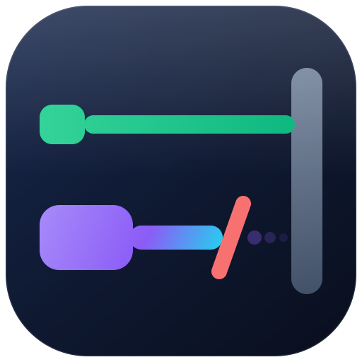

<p align="center">
  <a href="https://allan-nava.github.io/pqprobe/">
    
  </a>
</p>

<h1 align="center">pqprobe</h1>

<p align="center">
  <a href="https://github.com/Allan-Nava/pqprobe/actions/workflows/ci.yml"></a>
  <a href="https://allan-nava.github.io/pqprobe/"></a>
  <a href="LICENSE"></a>
  
  
</p>

---

**pqprobe asks one question about a TLS endpoint: which classes of client can
still complete a handshake with it, now that post-quantum key exchange is on by
default in browsers and CDNs.** One static Go binary, no dependencies, no
application data ever sent.

The interesting answer is never a single failure — it is the **asymmetry**:

```console
$ pqprobe probe origin.example.com
BAD   origin.example.com:443  pq-intolerant
  BAD   verdict                      pq-intolerant — post-quantum-capable clients cannot connect at all, while classical clients can
        ↳ the classical client connected and the post-quantum-capable one was cut off (reset): every client
          that merely *offers* ML-KEM fails here — Chrome and Edge 131+, Firefox 132+, a CDN with
          post-quantum enabled — while curl and your existing health checks keep passing
  WARN  handshake/pq-preferred       no handshake (reset): read: connection reset by peer
        ↳ an abrupt end means the peer never sent a TLS alert: it choked on the ClientHello rather than declining it
  OK    handshake/classic            TLS 1.3, X25519, TLS_AES_128_GCM_SHA256
```

That endpoint is up. `curl` is happy, the load balancer's health check is green,
the origin's own logs show 200s — and every request arriving through a CDN with
post-quantum enabled fails, because the CDN's ClientHello carries a ~1.2 KB
ML-KEM key share and something on the path cannot cope with it. This tool exists
because that outage happened, was diagnosed as an application problem for
several hours, and would have been a one-line answer with a probe that dials
like the CDN does.

## What it actually does

It dials the same endpoint several times with deliberately different client
shapes, and reads the *shape of the refusal*:

| The peer… | pqprobe calls it | Why it matters |
|---|---|---|
| completes the handshake on a hybrid group | `pq-ready` | done; re-check after TLS stack changes |
| falls back to X25519 when offered both | `pq-blind` | works today, breaks the day a client requires ML-KEM |
| sends a **TLS alert** to a hybrid hello | `pq-refusing` | it parsed and declined: a policy or pinned group list |
| **resets, times out or vanishes** | `pq-intolerant` | it choked on the hello: an outage waiting for a CDN default |
| serves TLS 1.2 and nothing newer | `no-tls13` | post-quantum key exchange is a 1.3 feature; a ceiling, not a setting |
| answers nothing | `unreachable` | not a grade — fix reachability first |

The alert-versus-reset distinction is the whole tool. A peer that says no
politely is negotiating; a peer that disappears mid-hello is broken for every
client that offers ML-KEM, whether or not that client would have been perfectly
happy with a classical group.

## Client profiles

```console
$ pqprobe profiles
classic       TLS 1.3 offering only classical groups (X25519, P-256)
              groups: X25519, P-256
              clients: curl, openssl s_client, any pre-2024 client, and every health check you already run

pq-preferred  TLS 1.3 offering hybrid ML-KEM first, with X25519 and P-256 behind it
              groups: X25519MLKEM768, X25519, P-256
              clients: Chrome and Edge 131+, Firefox 132+, CloudFront and other CDNs with post-quantum enabled, Go 1.24+, OpenSSL 3.5+

pq-only       TLS 1.3 offering only hybrid ML-KEM — no classical fallback
              groups: X25519MLKEM768
              clients: a client with post-quantum required, and the default of the next few years
```

`tls13-only` and `tls12` are there too, for the version edges. Every profile
pins its own group list and version window, so upgrading the Go toolchain can
never quietly change what a run proves.

**A profile is a capability class, never a fingerprint.** pqprobe builds its
ClientHello with Go's `crypto/tls`: it cannot reproduce Chrome's extension
order, and it never claims to. What it pins down is which key exchange groups
are offered and which TLS versions are acceptable — the property that decides
whether a post-quantum-capable client can finish a handshake. The client names
above are there so a report can say *who is affected*; nothing branches on them.

## A fleet, from the inventory you already have

```console
$ pqprobe probe --inventory ansible/inventory/edge --group edge --findings | jq '.[0]'
{
  "check": "verdict",
  "target": "10.11.10.5:443",
  "status": "BAD",
  "message": "pq-intolerant — post-quantum-capable clients cannot connect at all, while classical clients can",
  "hint": "…"
}
```

- `ansible_host=` wins over the inventory alias, because the alias frequently
  does not resolve outside the control node.
- `[group:vars]` is never read as hosts. (Reading it is how a probe list
  acquires an endpoint called `ansible_user`.)
- `1.2.3.4=origin.example.com` dials the address while sending that server name
  — the only way to reproduce a CDN-only failure from a workstation, and the way
  to find the *one* node out of six that is broken.

Real output over three public endpoints, September 2026:

```console
$ pqprobe probe example.com github.com google.com
WARN  github.com:443  pq-blind
  WARN  verdict                      pq-blind — no post-quantum support, but post-quantum-capable clients still connect on a classical group
  WARN  handshake/pq-only            no handshake (alert): remote error: tls: handshake failure
  OK    handshake/pq-preferred       TLS 1.3, X25519, TLS_AES_128_GCM_SHA256
OK    example.com:443  pq-ready
OK    google.com:443  pq-ready

3 endpoint(s): 1 pq-blind, 2 pq-ready · worst: 0 ERROR, 0 BAD, 1 WARN, 2 OK
```

## Install

```sh
go install github.com/Allan-Nava/pqprobe/cmd/pqprobe@latest
```

or build the static binary — and the `scratch` image, which contains nothing
but it:

```sh
go build -o pqprobe ./cmd/pqprobe
docker build -t pqprobe . && docker run --rm pqprobe probe example.com
```

## Output and exit status

| Flag | Output |
|---|---|
| *(none)* | text, worst endpoint first, hint on its own line |
| `--json` | everything, including every per-profile handshake result |
| `--findings` | the flat findings array the sibling tools speak — empty array, never `null` |
| `--min-severity S` | hide findings below `S`; the endpoint header stays |

| Exit | Meaning |
|---|---|
| `0` | the probe ran — findings are output, not an error |
| `1` | `--exit-on S` was given and something reached `S` |
| `2` | usage error, or no target could be parsed |

Exit 0 on a WARN is deliberate: a check that fails the pipeline on every
deviation is a check people learn to ignore.

## What it is not

- **Not a TLS scanner.** It does not enumerate cipher suites, grade
  configurations or chase CVEs — `testssl.sh` and `sslyze` do that well. pqprobe
  answers one question they do not ask.
- **Not a certificate monitor.** It reports leaf expiry and a leaf-only chain
  because it has them in hand; certificate lifecycle belongs in
  [checkfleet](https://github.com/Allan-Nava/checkfleet).
- **Not a load generator.** It opens a handful of connections per endpoint and
  sends no request. Traffic belongs in
  [crowdsim](https://github.com/HiWay-Media/crowdsim).
- **Not a fingerprinting tool.** See the profiles section: capability classes,
  not ClientHello signatures.

## Safety

pqprobe completes a TLS handshake and closes the connection. **No request, no
body, no credentials, no application data** — there is nothing in it that can
change state on the far side, which is what makes it safe to point at
production. The certificate chain is verified locally, from the certificates the
peer sent, and never with the trust store deciding whether the handshake
"worked".

## Development

```sh
go test ./...            # includes a server that dies on a large ClientHello
go test -race ./...
./scripts/backlog.sh lint && ./scripts/backlog.sh check
```

Documentation: <https://allan-nava.github.io/pqprobe/> — one static page,
generated by nobody, gated by `./scripts/docs.sh check`.

`BACKLOG.md` is the single source of truth for planned work and
[ROADMAP.md](ROADMAP.md) is generated from it. Why the tool exists and what is
deliberately out of scope: [INTENT.md](INTENT.md). Contributor brief:
[AGENTS.md](AGENTS.md).

## License

MIT — see [LICENSE](LICENSE).
